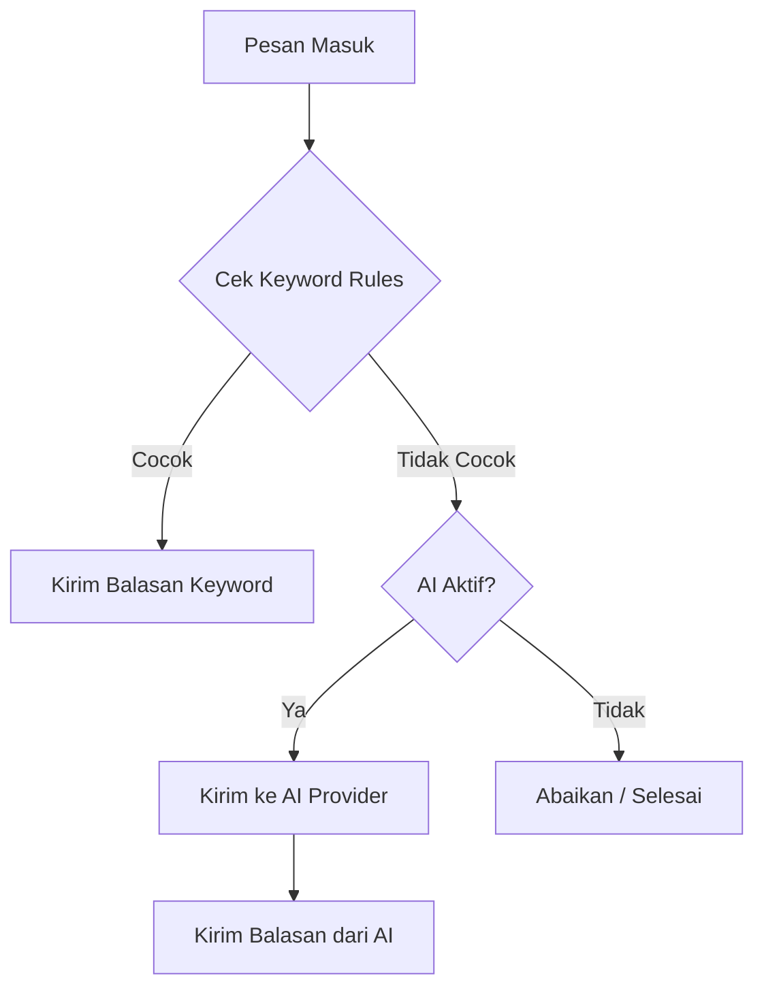

# 🤖 Auto-Responder (Chatbot Builder)

Fitur Auto-Responder memungkinkan Anda memberikan balasan otomatis secara cerdas berdasarkan pesan yang masuk. Sistem ini bekerja dengan dua lapisan logika yang saling melengkapi.

## 🔄 Alur Respon (Logic Flow)

Sistem akan memproses setiap pesan masuk dengan urutan sebagai berikut:

---

## 📋 1. Keyword Rules (Lapisan Utama)

Keyword rules adalah cara paling efisien untuk menjawab pertanyaan yang sering diajukan (FAQ). Anda dapat menentukan kata kunci tertentu dan balasan yang sesuai.

### Match Types (Tipe Pencocokan):
-   **CONTAINS**: Membalas jika pesan mengandung kata kunci (misal: "harga" akan membalas pesan "Berapa harganya?").
-   **EXACT**: Membalas hanya jika pesan sama persis (misal: "P" untuk memulai bot).
-   **STARTSWITH**: Membalas jika pesan diawali kata tertentu (misal: "Halo").
-   **REGEX**: Pencocokan pola tingkat lanjut untuk pengembang.

---

## ✨ 2. AI Fallback (Lapisan Cerdas)

Jika tidak ada keyword yang cocok, sistem dapat meneruskan pesan ke AI untuk memberikan jawaban yang lebih natural dan kontekstual.

### Provider yang Didukung:
-   **Google Gemini**: Direkomendasikan (Fast & Cost-effective).
-   **OpenAI (GPT)**: Standar industri untuk akurasi tinggi.
-   **Anthropic (Claude)**: Sangat baik untuk pemahaman konteks panjang.

### 🔑 Per-Device API Keys (Fitur Unggulan)
Anda dapat menentukan API Key yang berbeda untuk setiap perangkat WhatsApp. Ini memungkinkan Anda:
1.  Membagi beban kuota antar akun.
2.  Menghindari pemblokiran (Rate Limit) global.
3.  Menggunakan model AI yang berbeda untuk departemen yang berbeda.

> [!TIP]
> Jika kolom API Key di Dashboard dikosongkan, sistem akan otomatis menggunakan Key default dari file `.env` server.

---

## ⚙️ Cara Konfigurasi

1.  Buka menu **Auto-Responder**.
2.  Pilih Device dan klik **Kelola**.
3.  Pada tab **AI Settings**, pilih Provider dan Model yang diinginkan.
4.  Tuliskan **System Prompt** untuk mengatur kepribadian bot (misal: "Kamu adalah asisten toko yang ramah...").
5.  Aktifkan status Auto-Responder menjadi **On**.

---

[🏠 Home](../README.md) | [📱 Manajemen Device](DEVICES.md) | [🚀 Message Blast](BLAST.md)
