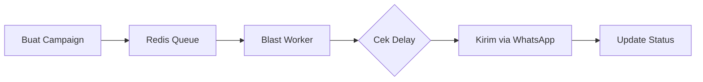

# 🚀 Message Blast (Mass Messaging)

Fitur Message Blast memungkinkan Anda mengirimkan pesan ke ribuan kontak atau grup sekaligus secara otomatis dan terjadwal.

## 🛠️ Cara Kerja Blast

Sistem menggunakan antrean (Queue) berbasis Redis (BullMQ) untuk memastikan pengiriman pesan berjalan stabil tanpa membebani server secara berlebihan.

---

## ✨ Fitur Utama

-   **Penjadwalan (Scheduling)**: Kirim pesan sekarang atau tentukan waktu di masa depan.
-   **Delay Antar Pesan**: Mengatur jeda waktu (misal: 3-5 detik) antar setiap nomor untuk menghindari pemblokiran oleh WhatsApp.
-   **Filter Target**: Pilih target berdasarkan **Group Kontak** atau **Tag** tertentu.
-   **Dukungan Media**: Kirim teks saja atau sertakan gambar/file dari Media Library.
-   **Tracking Real-time**: Pantau jumlah pesan yang Terkirim, Gagal, atau Menunggu secara langsung dari dashboard.

---

## 📝 Langkah Penggunaan

1.  Buka menu **Blast**.
2.  Klik **Buat Blast Baru**.
3.  Pilih Device pengirim.
4.  Pilih target (berdasarkan Grup atau Tag).
5.  Tulis pesan (Gunakan variabel seperti `{{name}}` untuk personalisasi).
6.  Tentukan jadwal dan klik **Kirim**.

---

## ⚠️ Tips Menghindari Banned

1.  **Gunakan Delay yang Manusiawi**: Minimal 3000ms (3 detik) antar pesan.
2.  **Personalisasi Pesan**: Gunakan nama penerima agar isi pesan tidak dianggap spam oleh algoritma WhatsApp.
3.  **Batas Harian**: Jangan mengirim ribuan pesan sekaligus dengan akun baru.

---

[🏠 Home](../README.md) | [🤖 Auto-Responder](AUTO_RESPONDER.md) | [🔌 Webhooks](WEBHOOKS.md)

## Struktur Database

Model Prisma yang terlibat:

- `BlastJob`: Data utama kampanye blast (Nama, Pesan, Template, Jadwal, Status Total).
- `BlastRecipient`: Baris antrian per-penerima (Status individual, Waktu kirim, Error log).

## Alur Sistem Backend

1. **Submit Job** (`blastController.ts`):
   - Admin membuat blast job.
   - Sistem meresolusi template untuk setiap kontak.
   - Menyimpan daftar penerima ke tabel `BlastRecipient`.
   - Memasukkan ID penerima ke antrian **Redis (BullMQ)** dengan delay yang bertingkat (_Staggered_).
2. **Worker Processing** (`blastWorker.ts`):
   - Worker mengambil job dari Redis secara paralel (Concurrency default: 5).
   - Mengambil data session WhatsApp dari `sessionManager`.
   - Mengirim pesan ke API WhatsApp (Baileys).
   - Memperbarui status di database dan mengirim update progres ke frontend melalui WebSocket.

## Konfigurasi Antrian

Parameter antrian dapat dikonfigurasi melalui `.env`:

- `REDIS_HOST`, `REDIS_PORT`: Lokasi server Redis.
- `MESSAGE_DELAY_MS`: Jeda dasar antar pesan dalam milidetik (default: 3000ms).
