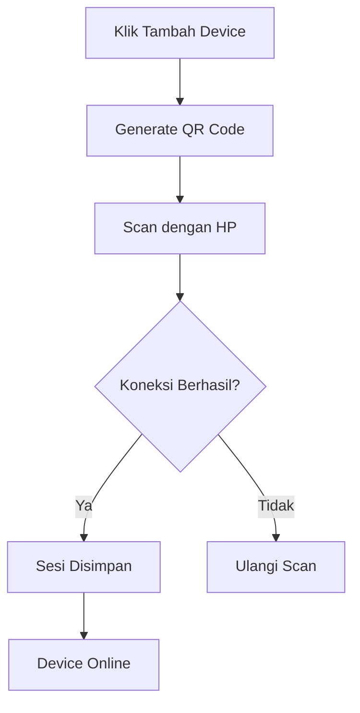

# Device Management

Fitur Device Management memungkinkan _User_ untuk menghubungkan akun WhatsApp mereka ke dalam sistem menggunakan QR Code, mengelola status koneksi, dan memantau perangkat yang aktif.

## Fitur Utama

- **Multi-Device Support**: Mendukung koneksi banyak perangkat WhatsApp sekaligus (terbatas sesuai paket langganan).
- **Real-time Status**: Memantau status koneksi (CONNECTED, DISCONNECTED, CONNECTING, QR_REQUIRED) secara langsung (WebSocket).
- **Session Persistence**: Sesi WhatsApp disimpan sehingga perangkat tetap terhubung meskipun server dimulai ulang.

## Struktur Database

Model Prisma yang terlibat:

- `Device`: Menyimpan data perangkat (Nama, Nomor Telepon, Status, Path Sesi).
- Relasi: Satu `User` dapat memiliki banyak `Device`.

# 📱 Manajemen Device

Sistem ini memungkinkan Anda mengelola banyak akun WhatsApp (Multi-Device) secara bersamaan dalam satu dashboard.

## 🔗 Proses Koneksi

Sistem menggunakan library **Baileys** untuk mensimulasikan login WhatsApp Web yang sah.

---

## ✨ Fitur Device

-   **Multi-Account**: Hubungkan lebih dari satu nomor WhatsApp (tergantung paket langganan).
-   **Status Monitoring**: Pantau apakah device sedang `CONNECTED`, `DISCONNECTED`, atau `INITIALIZING`.
-   **Auto-Reconnect**: Sistem akan mencoba menghubungkan kembali secara otomatis jika terjadi gangguan jaringan ringan.
-   **Session Data**: Data login disimpan dengan aman di folder `./sessions` (Backend).

---

## 📝 Langkah Menghubungkan Device

1.  Masuk ke Dashboard -> menu **Devices**.
2.  Klik tombol **Connect / Tambah Device**.
3.  Berikan nama untuk identifikasi (misal: "CS Jakarta").
4.  Tunggu QR Code muncul.
5.  Buka WhatsApp di HP Anda -> Perangkat Tertaut -> Tautkan Perangkat.
6.  Scan QR Code yang muncul di layar dashboard.

---

[🏠 Home](../README.md) | [🤖 Auto-Responder](AUTO_RESPONDER.md) | [🚀 Message Blast](BLAST.md)
