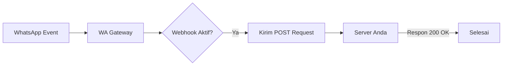

# 🔌 Webhook Management

Fitur Webhook memungkinkan sistem untuk meneruskan (_forward_) pesan masuk atau update status pesan ke server eksternal milik Anda secara real-time.

## 🔄 Alur Kerja Webhook

Sistem akan mengirimkan HTTP POST ke URL yang Anda daftarkan segera setelah kejadian terjadi.



---

## ✨ Fitur Utama

-   **Pesan Masuk**: Terima isi pesan, nomor pengirim, dan metadata lainnya.
-   **Security Secret**: Gunakan `X-Webhook-Secret` di header untuk memverifikasi bahwa request benar-benar berasal dari gateway ini.
-   **Toggle Per-Device**: Setiap perangkat dapat memiliki URL webhook yang berbeda-beda.

---

## 📝 Contoh Payload (Pesan Masuk)

Sistem akan mengirimkan JSON dengan struktur berikut:

```json
{
  "event": "messages.upsert",
  "deviceId": "uuid-device-123",
  "data": {
    "from": "62812345678",
    "text": "Halo, saya ingin bertanya tentang produk Anda",
    "timestamp": 1678234567
  }
}
```

---

## 🛡️ Keamanan (X-Webhook-Secret)

Untuk memastikan request yang masuk ke server Anda adalah valid, pastikan untuk memverifikasi header `X-Webhook-Secret`. Nilai secret ini dapat Anda temukan pada halaman pengaturan webhook di dashboard.

---

[🏠 Home](../README.md) | [📱 Manajemen Device](DEVICES.md) | [🔌 Referensi API](../API.md)
